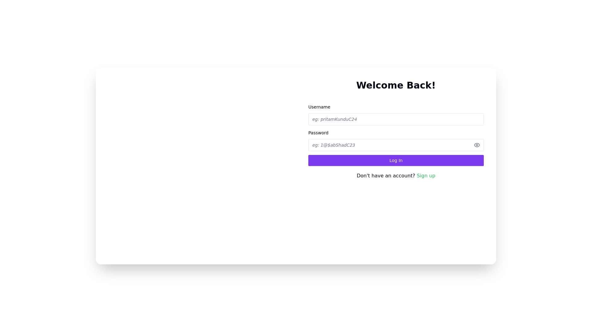

    updated on: 12th October 2024, Saturday

<div align="center">
    <picture>
        <source media="(prefers-color-scheme: light)" srcset="client/public/next.svg" width="200">
        <source media="(prefers-color-scheme: dark)" srcset="client/public/next-dark.svg" width="200">
        
    </picture>
    <br/>
    <p style="font-family: roboto, calibri; font-size:12pt; font-style:italic">A sleek next JS web app</p>
    <a src="https://github.com/warmachine028/next-book/forks">
        
    </a>
</div>

# [Next Book](https://github.com/warmachine028/next-book)

![line]

## Table of Contents

- [Introduction](#introduction)
- [Getting Started](#getting-started)
- [Developement](#developement)
- [Tech Stack Used](#tech-stack-used)
- [Preview](#preview)
- [Best Contributors](#best-contributors)
- [License](#license)

![line]

## Introduction

- Next Book is a full-stack social media web app built with cutting-edge technologies from the future, set in 2024.
- It leverages NextJS 15 and React 19, catering to the Next Fans.
- The app utilizes the Shadcn UI Library with Radix components, enhanced by Tailwind CSS.
- Fully responsive and meticulously maintained, Next Book offers a seamless user experience across all devices.

## Getting Started

- Create your account today with us at [next-book/signup](https://next-book-15.vercel.app/signup)

![line]

## Developement

```sh
$> cd client
$> npm i --legacy-peer-deps
$> npm run dev
```

![line]

## Tech Stack Used

- Framework: NEXT.JS 15
- FrontEnd: React 19
- Language: typescript
- Styling: tailwindCSS
- UI Library: shadcn/ui
- Database: Postgres
- Authentication: Lucia
- Hosting: Vercel

                       

![line]

## Preview

<picture align="center">
    <source media="(prefers-color-scheme: light)" srcset=".github/preview-light.png">
    <source media="(prefers-color-scheme: dark)" srcset=".github/preview-dark.png">
    
</picture>

![line]

## Best Contributors

<div align="center">
    <a href="https://github.com/warmachine028/next-book/graphs/contributors">
        
    </a>
</div>

![line]

## License

- See [LICENSE]

**Pritam Kundu, 2024**

![line]

## Thank you, everyone 💚

[icons]: https://icons8.com
[markdown-badges]: https://github.com/warmachine028/markdown-badges
[line]: https://user-images.githubusercontent.com/75939390/137615281-3a875960-92cc-407f-97fe-fd2319bdb252.png
[License]: https://github.com/warmachine028/next-book/blob/main/LICENSE

<!-- 12/10/24 -->
